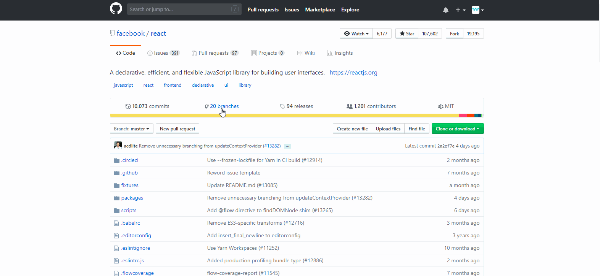

# Github Basics

## Github is the largest Git hosting site in the world. Git is a tool that software developers use to store source code (dot files like .java, .js, etc). Git creates a folder usually called a **repository** where it stores all the source code. Now, it's totally possible to store all your **repositories** in your local computer, the same way you store your images on your computer. 

## Think Google Drive or Microsoft Onedrive or Apple iCloud. These are cloud(a place where hard drives like the one inside your computer fill up acres of land) storage services that let you store your images, videos and documents on the cloud. People store their images on these cloud storage services because if something bad happens to your computer, your images are still safe on the cloud. It's essentially a backup for your data. 

## Now Github is similar to the cloud storage services we saw above. But the major difference is,  Github stores Git **repositories**. 

# **Experiment**

1. ### Login to your Github account. See your profile page from the dropdown at the top right corner. You should see your name, username and your contribution graph. The contribution graph shows your contribution history.

2. ### We'll just _**take a look at**_ some of the repositories stored on Github by different organizations. We'll start with Facebook's React. Try this link here: https://github.com/facebook/react. You can see the number of commits, branches, contributors and _**so on and so forth**_. You can also click on the colored graph to see the language color stats bar which shows you the percentage of various programming languages used in that particular repo. 

3. ### Next, try this link here: https://github.com/nodejs/node to see Nodejs Organisation's node runtime repository. 

4. ### There are many other large software projects that are not tied up to any organisations like Mike Bostock's D3: https://github.com/d3/d3. 

