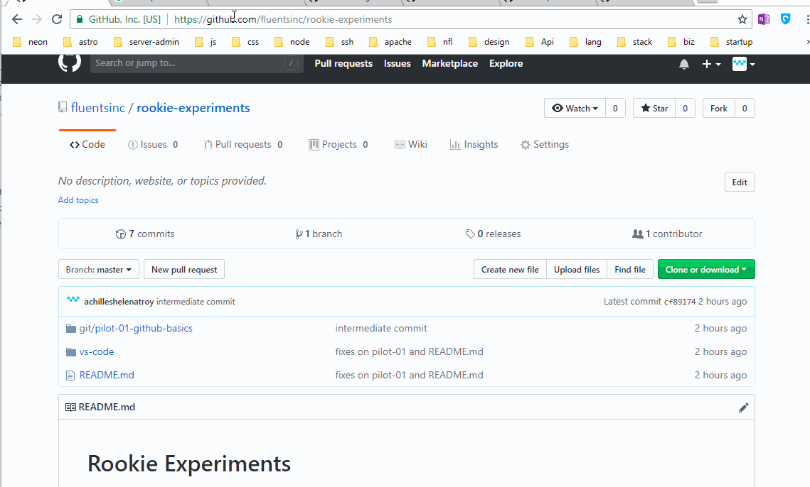
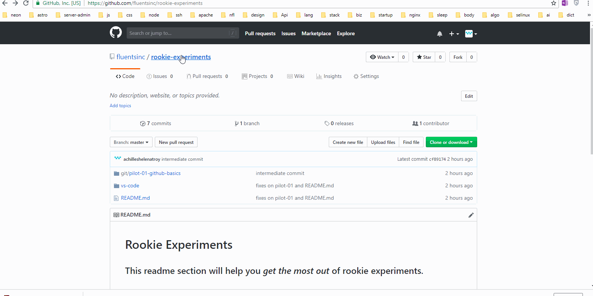

# **Clone Git Repository**

## Cloning a Git repository from Github is kinda similar to downloading your images or documents from Google Drive or Microsoft Onedrive or Apple iCloud. 

# **Experiment**

1. ### If you haven't been assigned pilots in **bash-shell** and **vs-code** yet, download the rookie-experiments repository without using Git as shown below. Link to rookie-experiments: https://github.com/fluentsinc/rookie-experiments

2. ### Unzip the downloaded zip file to get the repository folder. 

3. ### If you've been assigned pilots in **bash-shell** and **vs-code**, you can try out experiment #3. To clone a Git repository, copy the url of the repository you're trying to clone and call this command on bash: `git clone url-of-the-repo`. For example, to clone the rookie-experiments using Git: `git clone https://github.com/fluentsinc/rookie-experiments` 

