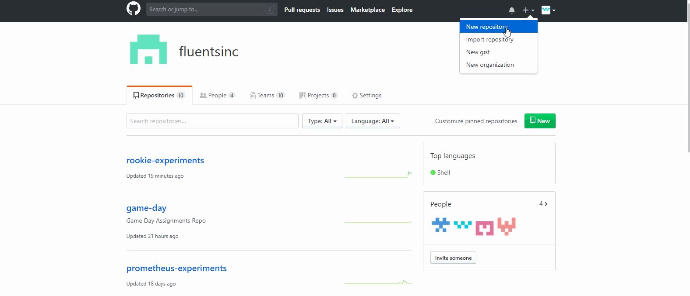

# **Push To Git Host**

## Let's assume you have an image on your computer, if it's really important and you want to create a backup, you could upload that image to OneDrive or iCloud or Google Drive. The point is, even if something bad happens to your image on your computer, you still have a backup on those sites. Kinda like that, you need to upload the Git repository on your computer to a Git hosting site such as Github or Gitlab or Bitbucket.

# **Experiment**

1. ### You could use any Git hosting site for our purpose but we are going to _**go with**_ Github. Login to your Github account. Create a new repository by clicking on the "plus" sign on the top right corner. Give the repository the same name as the Git repository that you're trying to upload. For example, if the Git repository you're trying to upload is named "iceberg", you need to create a repository named "iceberg" on Github. 

2. ### Once you click on "create repository", the website will take you to another page, the url of that page is your repository's url. Currently, you should see nothing but instructions on how to upload your repository from your computer. You should instead follow the instructions here in this pilot. You can see all the repositories you've created by going to your profile page. Click on "iceberg" when you get to the end of this pilot. It should show the files or folders you've created in the repository that's on your computer.  

3. ### Now that the repository is setup on Github, we can go back to our repository on our computer to upload the actual repository. So far, the repository on Github just contains the name of the repository. To upload the actual repository, you need to execute the following commands: 

- ### Make sure you create the first "initial commit" on the repository you've created on your computer. Otherwise, none of the below commands would work. 

- ### `git remote add origin url-of-the-git-repo`  replace the url-of-the-git-repo with the url of the repository you've created on Github. 

- ### For this "iceberg" example, the command is `git remote add origin https://github.com/achilleshelenatroy/iceberg.git`. Copy and paste the url from your repository on Github, don't copy the example url. 

- ### `git push -u origin master` this command will ask you for your Github username and password the first time you try to use it.  

4. ### Experiment-#3 shows the workflow you need to follow if you're trying to upload the repository for the first time. This experiment will show how you can upload the changes you've made after the first time. As you edit the repository in your computer by adding a new file or removing an old line, your repository on Github becomes outdated. You need to sync these repositories so as to keep them up to date. The workflow goes like this: 

- ### Create commits for your activity in your computer. Whether you added a line or deleted a file, it doesn't matter. If you had made edits, create a commit so as to record what happened. Once you've commit to the repository on your computer, you can upload those commits to Github. 

- ### `git push -u origin master` this command uploads all your edits. Works only if you've committed your edits on your computer. 

