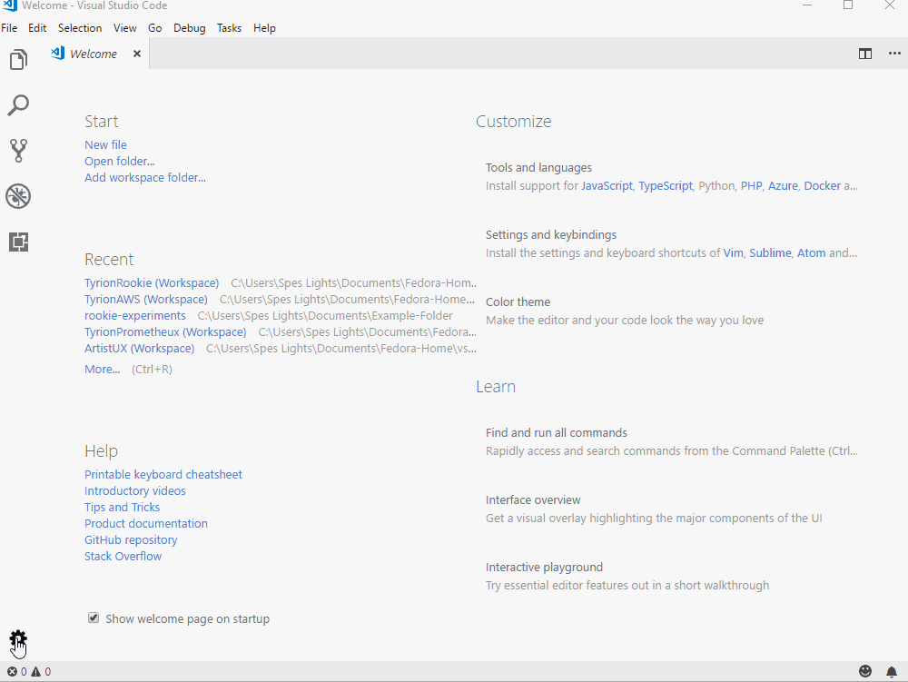

# **Basics**

## Software developers write source code (dot files like .js, .net, .java). That's what they do. Sometimes all day every day. They need to have the right tools to help them do what they do. One of the fundamental tools they would use is the **source code editor**. As the name suggests, a **source code editor** helps you write and edit source code. There are a lot of source code editors out there that you might like and it's definitely up to you to use your preferred source code editor. But we recommend using Visual Studio Code because of its simplicity, ease of use and all the built-in fundamental features that it offers.  

# **Experiment**

1. ### In this pilot, let's just get a quick look on some of the useful features that you would be using every day.  

2. ### Open up Visual Code. The first time you open up you should get a window like the one you see below. Hover your mouse pointer arrow over the activity bar on the left to see what happens when you click on those icons.  

3. ### Press `` ctrl + ` `` to open up the integrated terminal. Or you can click on "view" from the navigation bar at the top and select "integrated terminal". 

4. ### On the bottom left corner, you have the settings icon which shows different customizations you can do on your visual code like color theme, etc. You can see the same options when you click on "file" from the navigation bar at the top and hover over "preferences". 

