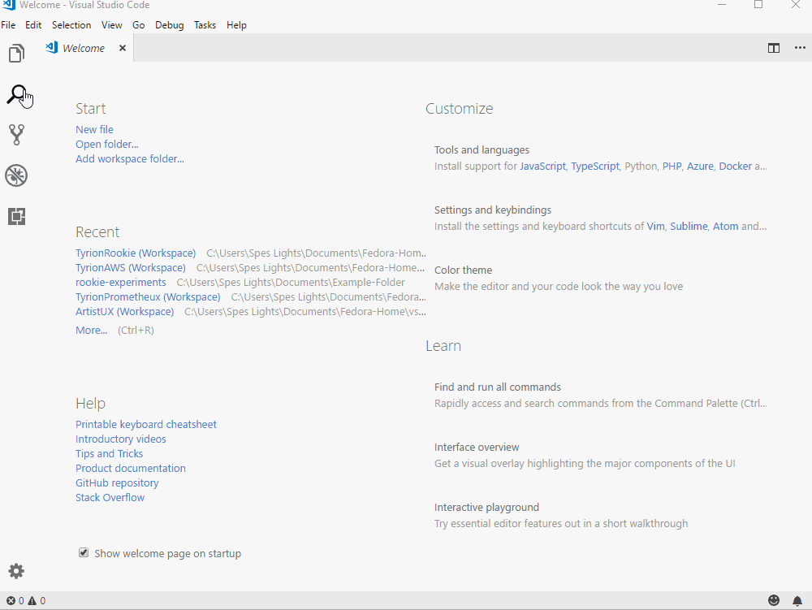
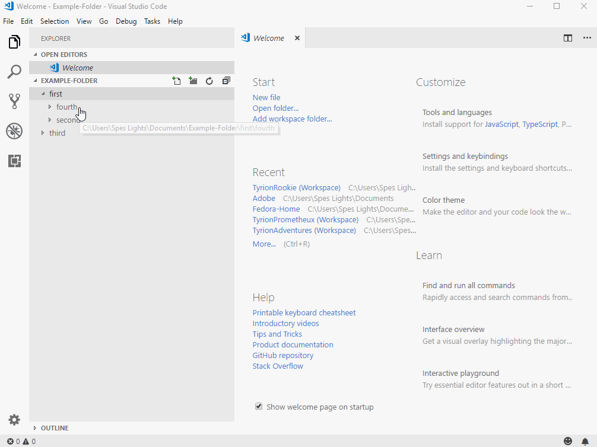
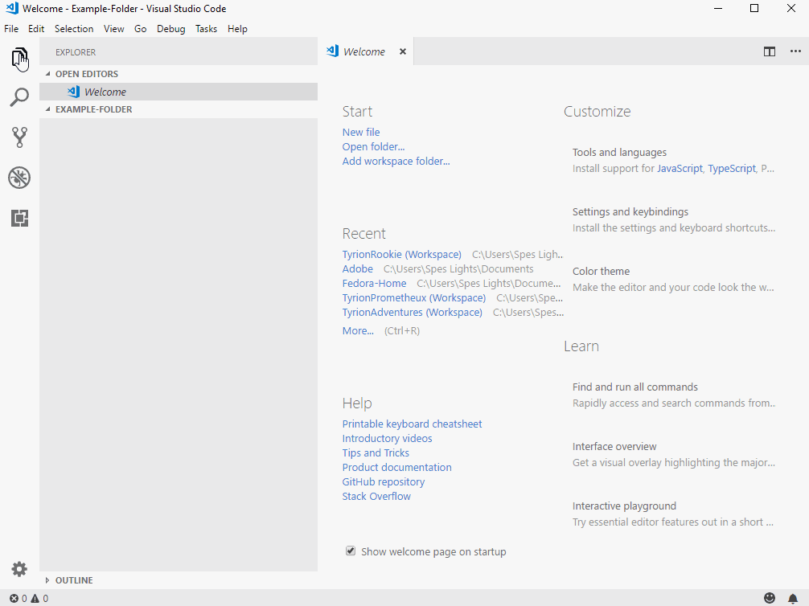
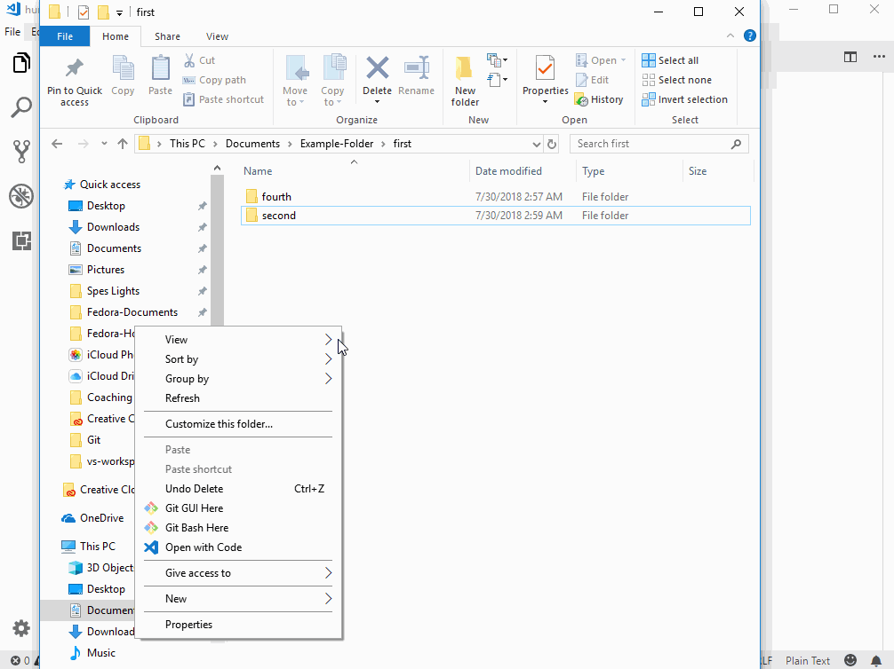
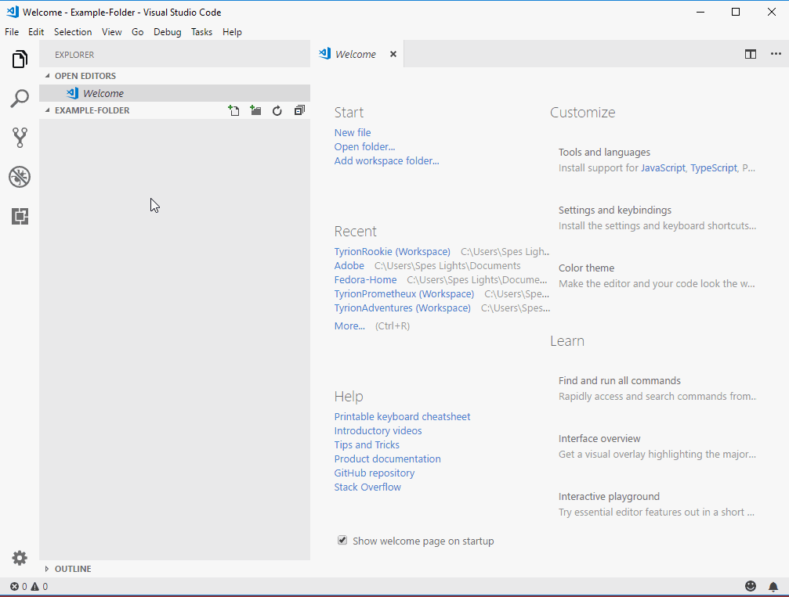
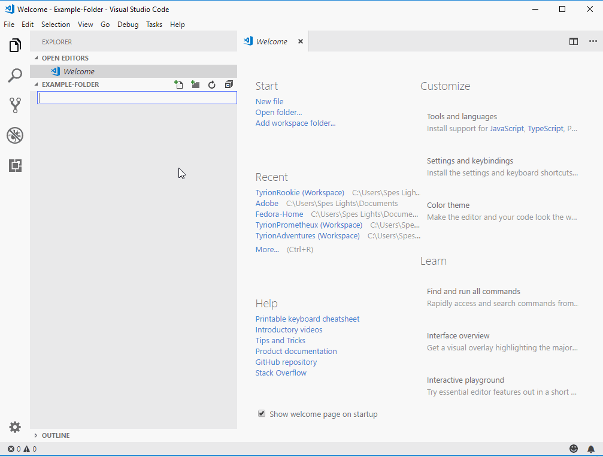

# **Visual Code Explorer**

# **Experiment**

1. ### Click on the explorer icon on the activity bar to reveal the explorer pane. Visual code explorer is similar to the file explorer you would find in Windows. It lists out the folders in your drive just as the windows file explorer. You can open any folder to see all the contents inside it without ever leaving visual code. 

2. ### Visual code explorer lets you cut, copy, and move folders and files just like the file explorer. 

3. ### If you create a folder in visual code explorer, you can see the same folder in file explorer. Similarly, if you create a folder in file explorer, you can see that same folder in visual code explorer as well.  Both visual code explorer and file explorer enable you to view and create files and folders in the same space (either hard-drive or external hard-drive). It's just that visual code provides an in-built explorer so that you don't have to leave visual code every time you want to use windows file explorer. 

4. ### You can also create files and folders by clicking on the visual code explorer pane or by double-clicking on the folders. 

4. ### Make sure you click on the visual code explorer pane before you create another folder or you might be creating child folders within the same folder. 

