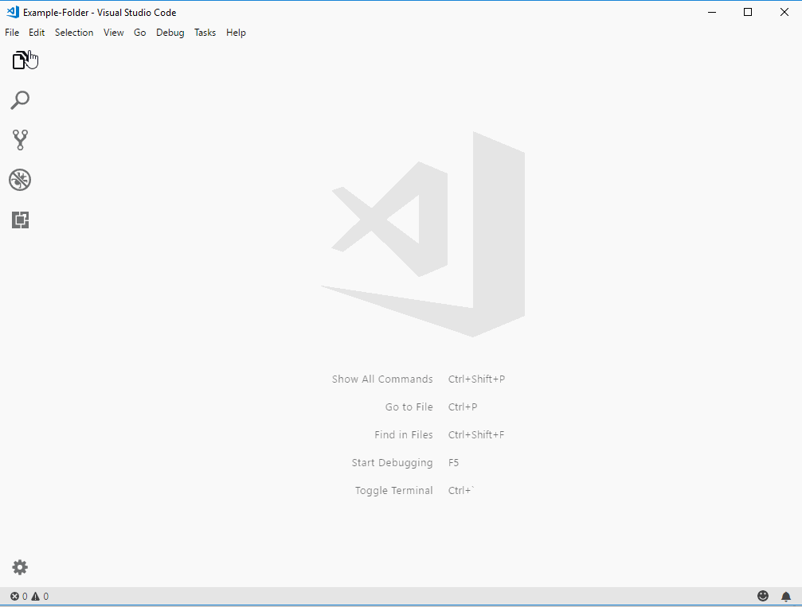
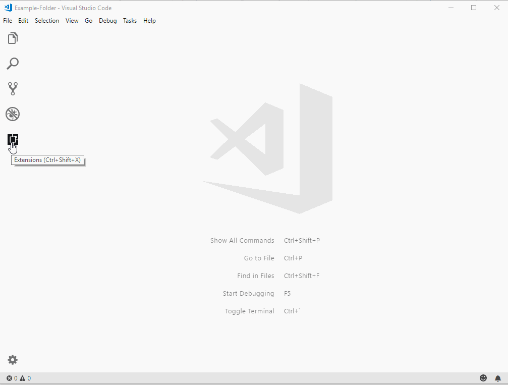
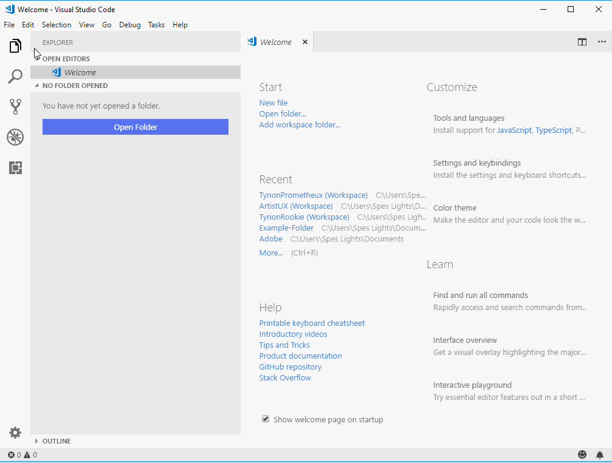

# **Manage Visual Code Extensions**

## You might think visual code has a lot of features but they are all fundamental features that a software developer might need. If you need a specific feature that's not available in the fundamental features list, you can install it as an extension . 

# **Experiment**

1. ### Open up the extensions pane from the activity bar. 

2. ### You should've seen the enabled and recommended pane by now. The **enabled** pane shows all the extensions that you've enabled on your visual code. And the **recommended** pane offers you extension suggestions based on your usage. So if you've working with javascript files, it might offer javascript related extensions that you might want to use. 

3. ### For this pilot, we are going to install an extension just to _**get the hang of it**_. We're going to install an extension called "markdown preview enhanced". This extension is written by Yiyi Wang. Make sure the author is Yiyi Wang. Type "markdown preview enhanced" in the extension search and install it. Make sure you click reload so that the extension can _**take effect**_ . 

4. ### Before you start with experiment #4, make sure you are comfortable with pilot-01 and pilot-02 of Git in rookie-experiments. Open the cloned Git repo folder in visual code as in **vs-code pilot-02**. Now we have everything we need to preview the markdown files(.md files) from within visual code, open up the pilot folder of your choice and right-click on experiment.md and select the option "open preview to preview the markdown files. This should be the way you need to view markdown files _**going forward**_ because it offers a lot of benefits over viewing from Github. 

