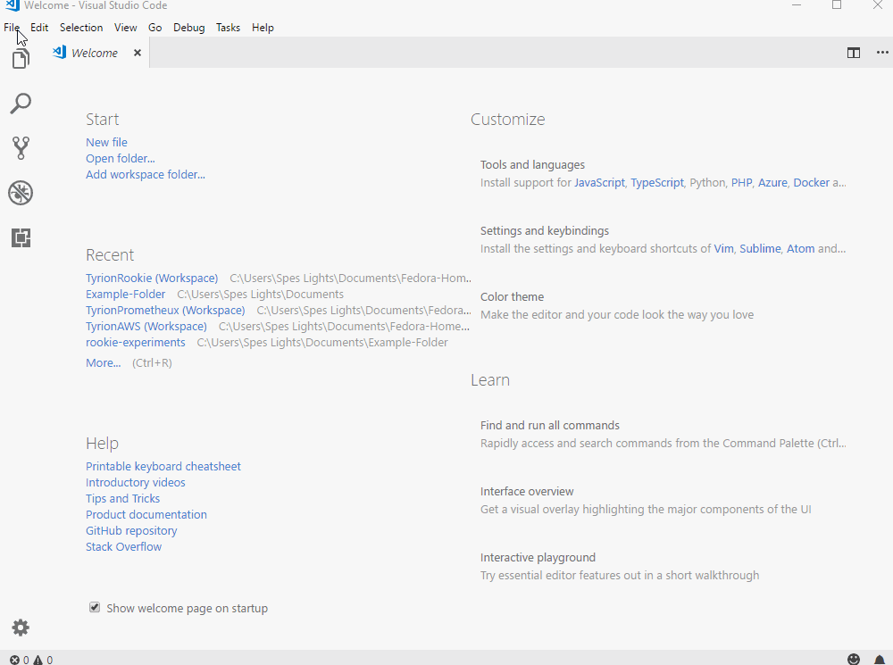
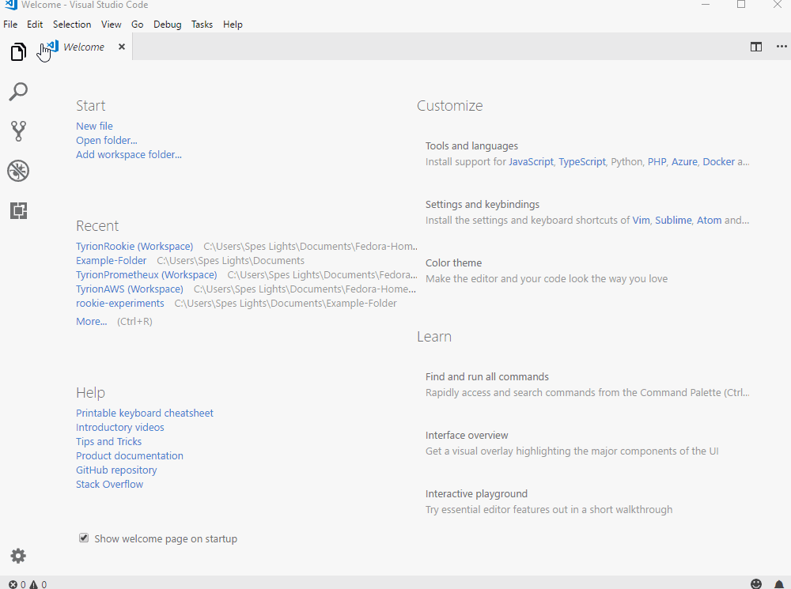
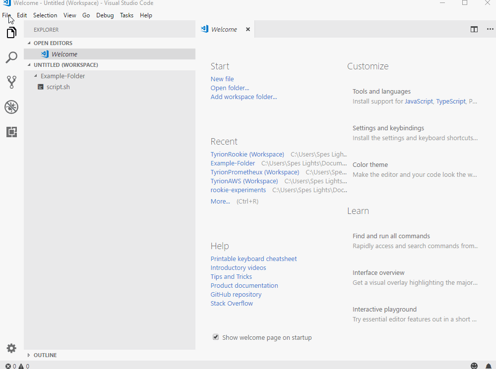

# **Save A Workspace**

## Workspaces feature in Visual Code lets you easily work with several different projects at one time. 

# **Experiment**

1. ### A workspace lets you use all the files or folders relevant for a particular project in one place. So if you're creating an Android App named "shift", you can create a workspace file named "shift"(you can create any name you like but it's advised you keep things relevant) to use all the files/folders relevant to this project in one place. The "shift" workspace file simply stores what files/folders are being used in the project - it doesn't save the actual files/folders in the workspace file - and shows the files/folders when you open the workspace file in Visual Code explorer. Let's try all this to _**hit the point home**_.

2. ### To create a workspace, use the "add folder to workspace" option to add all the files and folders you think are relevant to the project that you're working on. You can access the "add folder to workspace" either from selecting "file" and "add folder to workspace" or from the welcome screen when you open a new window. 

### **From File Menu**

### **From New Windows**

3. ### In experiment-#2, you've created a workspace file but you did not save the workspace file to your computer. You need to save the workspace and give it a relevant name to be able to open up the workspace file later. Save the workspace by selecting "file" and "save workspace as" option. Save the workspace file preferably in a folder where you keep all your other workspace files inside the master project folder. So in your computer, if the name of your master project folder is "project-x", you could create a folder named "workspaces" inside "project-x" and save the workspace file in the "workspaces" folder inside "project-x" folder. You can name the "workspaces" folder any name you want as long as you know that you save your workspaces file inside that folder. 

4. ### Once you've saved the workspace, you should always close the workspace by going to "File" and "Close your workspace". Then, reopen the workspace and start working on your workspace. There is a bug on visual code that doesn't set path to the newly added workspace folder and closing and reopening the workspace seems to fix the issue.  

5. ### To _**get into the habit of**_ saving a workspace and reopening workspace files, let's try to create a workspace for "rookie-experiments" repository. Clone the "rookie-experiments" repository as in `rookie-experiments/git/pilot-02` and save "rookie-experiments" folder to a workspace file. 

